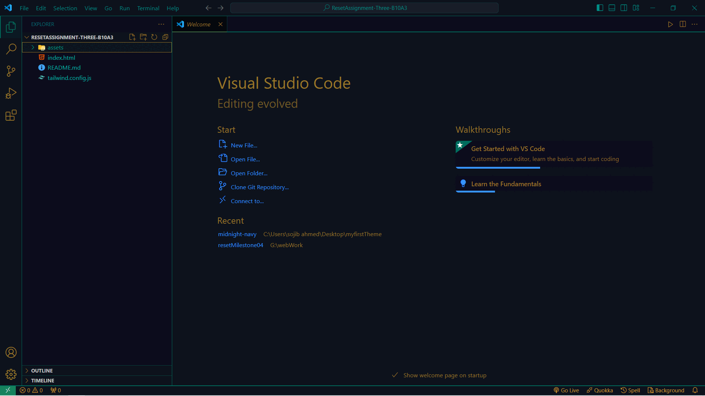
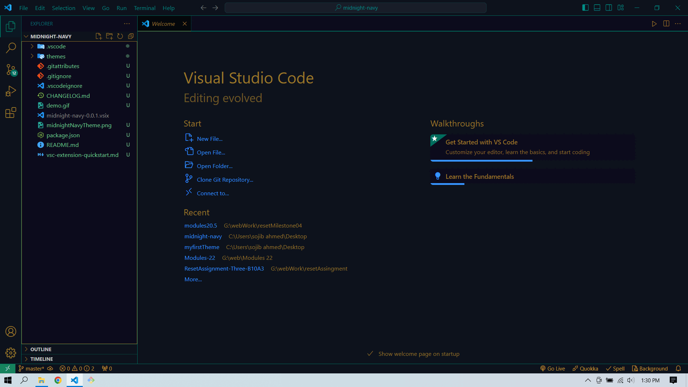
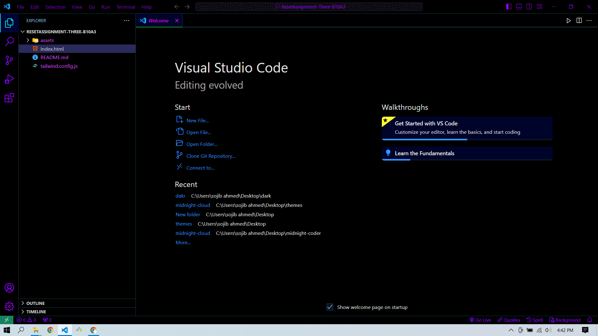
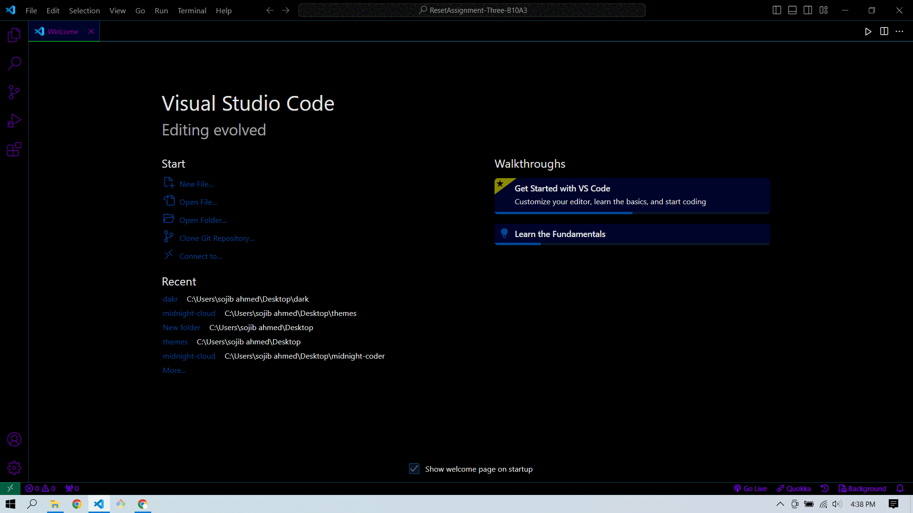

# midnight cloud

Dark cloud theme optimized for comfortable long coding hours.Focused dark navy palette for reduced eye strain while coding.

>
> ## Thanks for checking out my VS Code theme.
> ## Themes Included
> 
> * Midnight Cloud - Peace of the eye
> * Midnight Cloud - Deep Abyss
> * Midnight Cloud - Dark Superior
> * Midnight Cloud - Shadow Mist
>

__________________________________

## demo themes
__________________________________
- Midnight Cloud - Peace of the eye

__________________________________
- Midnight cloud - Deep Abyss

__________________________________
- Midnight Cloud - Dark Superior

__________________________________
- Midnight Cloud - Shadow Mist

__________________________________

> ## Installation
> - [x] Open the extensions sidebar on Visual Studio Code
> - [x] Search for Midnight Navy 
> - [x] Click Install
> - [x] Select the Manage Cog (bottom left) > Color Theme ＞ Midnight cloud
> - linux: `Ctrl + Shift + P `
> - macOS: `Cmd + Shift + P `
> - windows: `Ctrl + Shift + P ` 
Type theme, choose Preferences: Color Theme, and select Midnight cloud from the list. After activation, the theme will be activated.
> - [x] Click Reload to reload your editor
🌟🌟🌟🌟🌟 Rate five-stars 😃

**Enjoy!**
